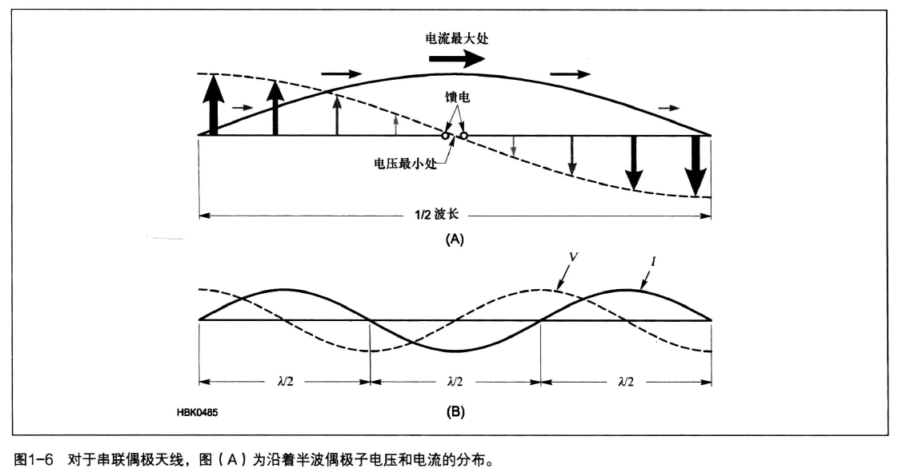
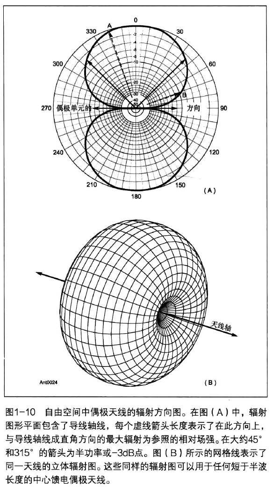
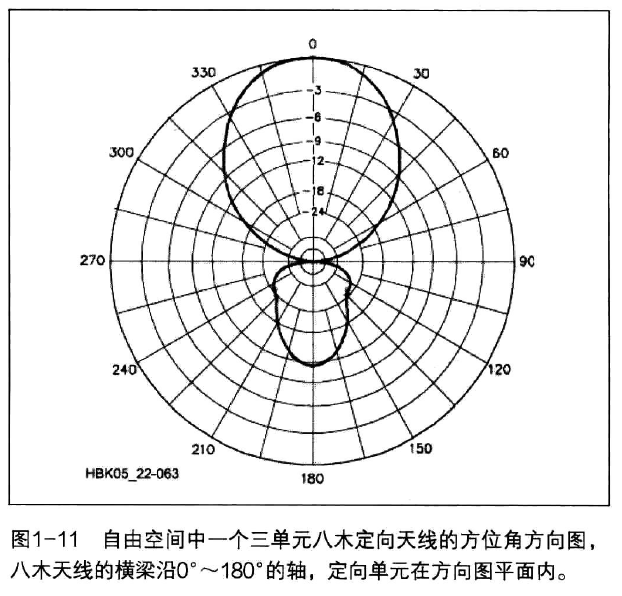

# Introduction

##### 辐射阻抗

加在天线上的功率通过两种途径消耗掉：

- 以热能的形式在导线和附近的电介质中损耗掉
  Pr = I^2 * R，R为损耗电阻
- 以电磁波的形式辐射出去，这部分功率是我们所要的，是有用的部分，
  Ph = I^2 * Ro，Ro为辐射阻抗，使用它计算得到的功率消耗等于线实际辐射出去的功率。这是一个用于计算的等效公式，没有物理意义。

天线的总功率等于P = Pr + Ph

一般，Ph < 0.1dB，Ph << Pr（不超过Pr 的百分之几）（天线周围没有太多物体，也不是太靠近地）
即只要天线的架设地点合理，其热损耗可以忽略，天线的总的阻抗（**馈电点阻抗**）就是辐射阻抗

##### 电流和电压分布

当用电源对天线进行馈电时，其电流和电压随着天线长度的变化而变化。
不管天线的长度是多少，电流的最小值都位于两端。
由于天线两端的电容效应，实际上电流的最小值也不可能为0。

绝缘体、天线两端的环和支持线都会产生电容效应，该效应也被称为边缘效应。射频电压正好与之相反，即电压的最大值在两端。
在半波天线的例子中，如图1-6所示，电压的最大值和电流的最小值在天线的中心。
其模式为：以1/4波长的间隔交替改变电压和电流的最小值，并沿着一个线天线以间隔1/2波长重复一次交替过程，如图1-6（B）所示。在每个连续的半波部分电流和电压的相位都被反转。
电压的最小值不是0，这是因为天线存在阻抗，这些阻抗包括导线的射频阻抗（欧姆式的损耗阻抗）和前面提到的辐射阻抗。

##### 馈电点阻抗

馈电点的阻抗是天线的第一个重要特性
在指定的频段内选择工作频率，需要了解一副天线的馈电点阻抗是怎样在一个波段内随工作频率变化
在多个波段使用一副天线，需要了解天线馈电点的阻抗在各个不同波段中的变化情况

天线有两种形式的阻抗

- 自阻抗
  自阻抗是天线完全远离其他任何导体时在馈电点终端所测得的阻抗
  电流要流过天线的馈电点，必须要有一定的电压。
  天线的自阻抗是馈电点电压与电流的比。如果电压与电流同相，那么自阻抗是个纯电阻，即电抗部分为零。这时的天线是“谐振”的（业余无线电爱好者通常对“谐振”一词的使用不是很严格，通常仅是指“几乎谐振”
  或“接近谐振”）。只有它是纯电阻时，谐振和阻抗的值才没有任何关系。
  除了在真正谐振的频点上，天线的电流和电压的相位是不同的。换句话说，此时天线表现为馈电点阻抗，而不是纯电阻。馈电点处的阻抗是由容抗或感抗与串联的电阻共同组成的
- 互阻抗
  互阻抗又称为耦合阻抗，是由于附近导体的寄生效应而产生的，也就是说，互阻抗是由于有导体处于天线的电抗性近场区产生的。互阻抗包括地的影响一一地是一个有损的导体，但它毕竟是一个导体。和自阻抗一样，互阻抗也是由欧姆定律定义的。不过互阻抗是一个导体中的电压和另一个（耦合）导体中的电流的比。相互耦合的导体会使有高度方向性的天线的方向图发生扭曲，也会改变馈电点处的阻抗。互阻抗将会在“高须八木天线和方框天线”章中详细介绍，这对正确操作这些波束天线是至关重要的

是否需要谐振？
应该注意到天线不需要谐振就可以成为有效的辐射体，事实上这对谐振天线来说没什么奇怪的，但前提当然是你要用有效的办法对天线馈电。很多业余无线电爱好者使用非谐振（甚至是任意长度的）天线，这些天线使用明线传输线馈电并且用到了天线调谐器。这种天线系统和使用同轴电缆与谐振天线的系统是一样的辐射信号，这种天线通常还可以在多波段上使用。在这个系统中，应该使所有的损耗达到最小。

##### 天线方向性和增益

- 各向同性辐射
  各向同性辐射体（isotropic radiator）是一种纯理论化的天线。描述如下：一副在外层空间中与所有其他东西完全隔离的无限小的天线，其形状为一点，有一个无限小的发射机给这副无限小的点天线馈电，它向所有方向辐射相等的能量，它对任何方向都没有偏向性，它完全没有方向性
  各向同性辐射体作为一种比较的尺度在实际测量一副天线时是很有用的。

- 方向性

  实际所有的天线都会有一定程度的方向性，在某个方向辐射强些，在其他方向上辐射弱一些，在某些方向上其辐射强度甚至可能为零，天线的这种方向性并不意味着坏事，例如，接收从某个方向过来的信号的天线可以消除其他方向上的干扰和噪声，从而提高信噪比。

- 方向系数
  自由空间中的天线的方向性可以在数量上把它的三维方向图与各向同性天线比较。在假想的半径为数个波长的理想球体中心放置各向同性天线，其场强（单位面积的能量，或称为“功率密度”）在假想球体的表面的每一点都是一样的。而在这个相同的假想球体的表面，待测天线辐射出与各向同性天线相同的功率，其方向性导致在某些点处功率密度大些，而在另一些点处功率密度小些。最大功率密度与整个假想球体表面的平均功率密度（等于各向同性天线在相同条件下的功率密度）之比可以用来衡量天线的方向性。也就是：D=卫（1-6）Pav其中D称为“方向系数”，P为假想球体表面最大功率密度，Pa为平均功率密度。
  天线的增益与天线的方向系数密切相关。因为天线的方向系数只由天线的方向图决定，它并不关心实际天线中的任何功率损失。

- 增益

  在计算增益的时候，必须把这些损失从加在天线上的功率中减去。一般来说，这些功率损失占天线输入功率的一个固定的百分比，因此天线的增益为G=kP=kD（1-7）Pav其中G为天线的增益（以功率比表示），D为方向系数，k为天线效率（辐射功率除以输入功率），P和Pay如前面定义。
  对业余无线电用得很多天线来说，天线的效率是很高的（损耗部分只占总功率的百分之几）。这时，天线增益可近似地认为等于天线的方向系数。天线的方向图压缩得越厉害——或者用通用的术语说，天线的波瓣越尖锐，天线的增益就越高。得出这个结论是很自然的，天线的辐射功率要在某个方向上比较大，其他方向上自然比较小，那么天线的波瓣就比较窄了。这样天线辐射出去的能量就集中在某些方向上，其他方向上能量就比较小。一般来说，在相同波瓣半径的三维方向图中，波瓣体积越小，功率增益越高。
  如前所述，天线的增益与方向系数有关，而方向系数又与方向图形状有关。天线方向图主瓣宽度是一个常用的衡量天线方向性的指标，这也是与天线增益相联系的。这个宽度以两个半功率点即-3dB点之间所夹的角度表示，常被称为
  “半功率波束宽度”。
  这一信息只能给出天线相对增益的大体概念，而不是确切的测量。因为绝对数据的测量需要知道假想球体表面上每一个点的功率密度，而单个平面的方向图只能表示出球体中的一个大圆所在平面的情况。习惯上，在对几副天线进行对比之前，必须起码测量各自的E面和H面方向图。
  可以用公式（1-8）来估算天线相对于各向同性天线的增益，但条件是天线的副瓣相对于主瓣较小，而且天线在电阻上的（热）损耗也较小。如果天线的方向图比较复杂，就需要用数值方法才能得出实际的增益了。
  G41253（1-8）H3uB ×EuB其中HiB和E3dB分别表示对应平面上的半功率瓣宽，单位为度。

- 方向图
  显示在离天线固定远处，场强随天线的方向变化而变化的函数关系的真实或相对的图样
  确定测量点与天线的距离，以及测量点离开地面的高度，那么所有测量点构成一个以天线为圆心的水平圆环。对待测的天线加上一定的功率，用场强仪测量信号的强度。也可以转动待测的天线，而不是移动测量仪器。也可以利用天线的互易原理，天线的接收图样和发射图样是一样的。给小功率发射机接上天线，对待测天线发射，而待测天线则连接到测量仪器上。另外关于测量天线方向图的技术在“天线和传输线测量”一章中介绍。

- 电抗性近区场区域
  “电抗性”指的是发射天线和接收天线的互阻抗在本质上可以呈容性，也可以呈感性。
  离待测天线很近的区域会发生源和接收天线之间相互耦合（它可能改变你正试图测量的方向图），为了保证测量的精确度和重复性，最重要的是防止这种相互耦合。
  有时也被称为感应场，意思是在这个区域中，磁场通常相对于电场来说处于支配地位。这时，天线就像一个非常大的集总参数的电感或电容，在近区场储存着能量而不是通过空间发射出去。
  对简单的导线天线来说，电抗性近区场通常被认为是离天线辐射中心半个波长的区域。在稍后提及八木天线和方框天线的章节中，你会发现天线单元之间的相互耦合可以被有目的地用来改变天线的方向图。但对测量天线的方向图来说，我们不希望两副天线离得太近。
  在电抗性近区场中，场强随待测天线距离变化的规律是十分复杂的。

- 辐射近区场和辐射远区场
  越过电抗性近区场后，天线的辐射场又分为辐射近区场和辐射远区场
  虽然在电抗性近区场中，电抗性场占主要地位，但辐射场与电抗性场是共存的。
  辐射近区场和辐射远区场的界线的定义则被广泛接受为：D = 2 * L^2 / λ
  L为天线的最大物理尺寸，单位是波长
  图1-9描述了普通线天线的3种场。
  在本书余下的内容中我们主要讨论天线的辐射远区场，正是天线的辐射远区场把电磁波传播开去的。远区场辐射的一个显著特点是场强与距离成反比，而且虽然电场与磁场在波前处是正交的，但在时间上是同相的。全部能量在电场与磁场间平均分配。离天线数个波长以外，就是我们要考虑的全部的场了。要准确地测量天线的辐射场，我们必须把测量仪器放在离待测天线数个波长以外的地方。

- 辐射方向图的类型
  测量方向图时，所测量平面上的离地面的距离都是一样的。在自由空间放置一个半波偶极天线（见“偶极和单极天线”章节），在单个平面上对其进行测量（包括天线的连接线在内）所得到的方向图与图1-10(A)相似，该天线位于双箭头所指定方向的中心处。在其连接线的轴向位置辐射最强，越到两端时，天线几乎没有辐射。
  辐射方向图是描述一个天线方向性的图形。该图形一般画在极坐标系中，角度量表示图中中心位置到外环的方向和大小。像8字形的平滑曲线表示了在每一个角度上天线辐射信号的相对强度。
  图1-11所示的方向图给出了零点（辐射强度最小的点）位置和波瓣（两个零点之间的曲线）形状。除了特别注明和几个图形之间的对比之外，主瓣是指在整个波瓣中辐射强度最强的那一瓣，以下两种情况除外，即特别注明的一些较大辐射强度和几个对比图显示的最大辐射强度。主瓣峰值所在的外环位置被当作一个参考点。主瓣峰值可以位于任何角度。其他所有的波瓣都被称为旁瓣，而且其位置也可以是任何角度，包括天线的背面。方向图中除了主瓣和零点之外，还标出了所谓的“半功率点”，这些点处的功率是主瓣峰值的一半。

  实际上，任何天线的方向图都是三维的，因此单个平面上的绘制是不够的。自由空间中的立体方向图是通过测量离天线中心等距离的球面（想象中的球面）上每一个点的强度构建的。这样测得的信息就可以构成一个立体的图样。在任何给定的方向上，如图1-10（B）所示，球面上的点到固定点（天线的位置）的距离都和天线在该方向上的场强是成正比的。图1-10（B）所示为半波偶极子天线的三维立体辐射方向图。图1-10（A）可以被看作是三维立体图在其天线轴上的一个横截面。两个这样的图（即一个包含偶极天线的直导线，一个包含垂线）可以传达大量的信息。通过观察这两个平面图，然后再经过头脑的想象和加工，我们就可以虚构成相对精确、完整的立体方向图，前提是这种天线就像图1-10所示的简单偶极子天线一样，而且它的方向图是平滑的。

  

  

- 方位角和仰角方向图
  当天线架设在地面上而不是在自由空间时，对于该天线的方向图，我们将自动得出两个参考框架一方位角和仰角。方位角通常以天线的最大辐射角度为参照，并把此角度定义为0°，或者以地理正北作为方向角的参考，地理正北是指实际指南针所指的方向。
  仰角是以地表水平面为参照，认为地表水平面是0°。虽然地球是圆的，但是由于其曲率很大，所以在这里可以认为天线下方所处的区域是平的。90°的仰角就是天线的正上方（顶角），然后这个角度朝后减为0，即天线的正后方。（专业的天线工程师描述天线方向时以天线正上方的点作为参考，即使用顶角。仰角可以由90°减去顶角得到。）图1-11所示为一个方位角或者顶角方向图。从图中可以看出该天线在所有水平方向上的增益。与地图一样，0度角在最上方，其他角度沿着轴线顺时针的增加。（这个不同于产生数学函数的极坐标图，即0°在最右边，其他角度沿着轴线逆时针的增加。）图1-12所示为同样天线的一个仰角方向图。不过这次从图中看到的是该天线在所有垂直方向上的增益。在负仰角处，地面反射了或阻碍了电磁波的辐射，这就没有必要画出地下辐射图。在自由空间，该辐射图不包括底部-90°的半圆。
  然而，若没有参考地面，术语“仰角”就没有多大意义了。
  在业余无线电领域，场强的相对值就足够了。换句话说，我们并不需要知道在天线加入一定功率下，在离天线1英里处会产生多少士V/m的电场（但在FCC标准中，这是AM广播天线系统必须符合的规定）。
  无论收集到（或用理论公式计算出来）什么数据，我们经常对其值归一化，使最大值刚好达到图表的外沿。在极坐标系中，方向图的形状并不会随归一化而改变，改变的只有方向图的大小。（请参阅本章最后的侧栏“辐射方向图的坐标尺度”——关于如何选择坐标尺度的信息。）E面和H面方向图
  你也会碰到E面和H面辐射方向图。这些可以显示与天线电场或磁场平行平面的辐射方向图。对于具有水平单元的天线，电场位于水平平面，所以E面辐射图和天线的方位角辐射图是一样的。由于磁场方向和电场方向是垂直的，所以H面辐射方向图所在的平面和E面辐射方向图所在的平面也是垂直的。如果E面辐射方向图是一个方位角式的方向图，那么H面辐射方向图将会是一个仰角式的方向图。注意E面和H面辐射方向图和地球表面没有固定的关系，记住这一点是非常重要的。例如，一个水平偶极子天线的E面辐射方向图是一个方位角式的方向图，如果该天线处于垂直方向，那么其E面辐射方向图就随之变为一个仰角式辐射方向图。因此，大部分的E面辐射方向图和H面辐射方向图在自由空间中的天线系统中被创造。

- 
- 1.3.6辐射方向图的测量
  给定了基本的辐射方向图和坐标系，通过对天线方位角辐射方向图进行对比，可以很容易地定义出一些有用的测量方法和参量。对定向天线来说，除了增益，最常用的参量是前后比率（简称为前后比F/B），即指定的前向方向增益和后向增益之差，其单位为dB。图1-11所示天线的前后比约为11dB。假设辐射方向图是对称的，还常常用到前侧比的概念，即前向天线增益和侧向（与前向成直角的方向）增益的差值，这种一般多见于有平行阵列的八木天线和方框天线。在图1-11中，前侧比率大于30dB。
  因为天线的背向方向图的幅值有很大的波动，所以有时才会用到“前背比率”这个概念。前背比率使用的值为指定角度上背向增益的平均值，该角度方向通常是天线最大增益的180°半圆反方向，而不是与前向夹角正好为180°
  的单个增益值。
  如图1-11所示，天线的波束宽度为54°，这是因为方向图与-3dB增益刻度的交叉点到天线峰值某一侧的夹角为27°。若天线方向图具有很小的波束宽度，那么该方向图被称为“锐化”或“窄化”方向图。
  在一个天线的方位角方向图中，若所有方向上的天线增益是相等的，该天线则被称为全向性天线。这和各项同性天线是不一样的，各项同性天线是指其在水平和垂直面上的所有方向都具有相同的增益。
- 方向图的坐标尺度
  在画天线的方向图时，有几种不同的坐标尺度可供使用。业余无线电爱好者们有时会见到使用矩形网格坐标系方向图，但极坐标系统则更为常用。极坐标系统可分为3类：线性、对数以及改良对数。
  必须记住的一点是，天线方向图的形状是和其坐标系有关的。图1-A所示就是一个例证。这里把一副定向天线的方向图画于3个不同的坐标系中。
- 线性坐标系
  图1-A（A）就使用了线性极坐标系，同心圆的距离是相等的，并被分别标为0~10。这种坐标系可用来线性表示天线的方向图。为了便于比较，我们把这几个等距同心圆的标注用分贝代替，以最外沿的圆为0dB。这时，副瓣被抑制了。比主瓣低15dB左右的副瓣则由于太小而完全看不见了。这种表示方法对有高方向性的低副瓣的天线阵列很好用。不过，线性坐标网格不常用。
- 对数坐标系
  天线生产商常用的另一种坐标系是对数坐标系。同心圆的距离是以信号电压的对数值来取定的。如果把这些以对数距离取定的同心圆用相距适当距离的以对数标注的同心圆代替，这时这些对数坐标圆的距离就是线性的了。从这个角度来看，对数坐标系可以称为线性-对数坐标系，即用对数校正过的线性分隔的坐标系。
  这种坐标系增大了副瓣的显著度。如果你的目的是要显示出一个阵列有一定的全向性，那么这种坐标系刚好合此目的。在圆周内有8dB或10dB的方向性差异的天线在这个坐标系中看起来更接近全向性，见图1-A（B）。
- ARRL对数坐标系
  ARRL 使用的改良过的对数坐标系中同心圆间隔为信号电压对数值的0.89倍。在这种坐标系统中，比主瓣低30~40dB的副瓣也可以识别出来。这样的副瓣在VHF和UHF中是比较引人关注的。0~-3dB的距离明显比-20~-23dB的距离大，而后者又明显比-50～
  -53dB的距离大。
  这些距离大体显示了它们对天线性能变化的重要程度。本书中的天线方向图都是在ARRL对数坐标系上绘制出来的，见图1-A（C）。
- 直角坐标网格
  天线辐射方向图也可以被画在直角坐标系上，其中水平轴为角度，垂直轴为天线增益，如图1-A（D）所示。相对于极坐标系，直角坐标系在描述多个方向图时更加容易。使用直角坐标系可以很容易地估算出旁瓣电平，尤其是当几个天线在一起进行对比时，这个坐标就更加有用。
- 分贝的介绍
  天线的功率增益通常用分贝表示。分贝是实际中常用来衡量功率比值的单位，因为这种表示方法比功率比本身更紧密地把功率在远处产生的实际作用联系在一起。一个分贝代表了刚好可以检测到的信号强度变化，而不论信号强度的实际值是多少。例如，20分贝（dB）的信号强度，代表了检测到了信号强度增加了20格。20dB相对应的功率比（100：1）在通信中则是比较夸张的想法。任何功率比所对应的分贝值等于功率比的常用对数值的10倍，即

$$
\mathrm{dB}=10 \log _{10} \frac{P_{1}}{P_{2}}
$$

如果给出的是电压比，则分贝值等于电压比的常用对数值的20倍，即
$$
\mathrm{dB}=20 \log _{10} \frac{V_{1}}{V_{2}}
$$
在使用电压比的时候，所测得的两个电压值必须是在相同阻抗的前提下得出的，否则得出的分贝值是没有意义的，因为从根本上说测量电压比就是为了测量功率比。
使用分贝表示的主要原因是连续的功率增加用分贝表示时，只需把分贝值简单地相加。因此增益3dB再增益6dB后，其总增益为9dB。如果用普通的功率比，这些比值就要相乘了。
功率的减小也只需简单地减去相应的分贝值就可以了。因此，功率减小为原来的一半对应于分贝值减小3dB。
例如，如果在系统的其中一部分中功率增加到原来的4倍，而在另一部分中功率减小为原来的一半，则总功率增益为4×0.5=2，也就是6-3=3dB。功率的减小或“损失”
用分贝表示只需简单地在分贝值前加上一个负号。
当P2和Vi是一些固定的参考值，所添加的字母“dB”
是指关于参考值的分贝。这也允许电压和功率的绝对值用dB表示。在业余无线电中，你常常会碰到dBm（P2=1mW）
和dBμV（P=lμV）。
更多关于分贝的信息请阅读ARRL网站上“分贝和功率”栏目，其网址为www.arl.org/files/file/Get/%20
Licensed/PowerAndDec.pdf.

# 环形天线

## 大环天线

## 小环天线

“小”环可以被认为是一个简单的、相当大的线圈，并且这样一个环中的电流分布与一个线圈的电流分布是相同的。也就是说，环中每部分的电流具有相同的相位和相同的幅度。为了满足这个条件，环中导体的总长度不得超过约0.11。
各种形状的小环天线存在许多年了，可能最让人熟悉的一种形状是在便携式AM广播收音机里面的铁氧体磁棒天线。这类小环天线在业余方面的应用主要包括无线电测向、1.8MHz和3.5MHz低噪声定向接收，以及小型发射天线。因为用于发射和接收用的环天线设计考虑上有些不同，这两种应用情况都在本部分分别讨论，这部分信息由Domenic M.Mallozzi（NlDM）来执笔。小环天线系统的应用在“接收和测向天线”一章和“隐形和空间受限天线”一章中叙述。

##### 什么是小环天线

当环的导体总长度小于0.1（本节中是小于0.0852）时，从电气角度来讲，就说它是小环天线。这个尺度是基于在整个环周长上的电流必须相位相同这个因素，当绕圈导体长于0.0851时，就不成立了。

该约束因素导致小环天线产生一个可以预测得到的8字形辐射形状，如图5-21所示。
这个最简单的小环天线是一个1圈的非调谐环，并且负载与位于其中一边中心的一对接线端连接在一起，如图5-22所示。如果我们看看这种天线相对于信号源在某些时刻的“快照”，就不难画出天线辐射图是如何演变出来的。图5-23表达了处于上方的环与瞬间辐射的电压波形，注意到环天线的A和B点正收到相同24的瞬间电压，这意味着没有电流通过这个环，因为在两个等电势的点上是没有电流流动的。图5-24也给出类似的分析，将环在图5-23所示位置转动90°，显示出在该位置环天线有最大响应。当然，由于环天线很小的物理尺寸，由通过的电波产生的电压值也很小。图5-23是给出的理想的小环天线辐射图。

##### 有效高度

能够传递给接收机相同电压值的一段地面上导线的垂直段的高度（或长度）。等式如下：
$$
h=\frac{2 \pi N A}{\lambda}
$$

- h=有效高度，m
- A=环面积，m^2
- N=环的圈数
- E=射频场强，V/m
- θ=环平面与信号源（发射台）夹角
- λ=工作波长，m

##### 环天线两端点间电压

$$
V_{Non-turning}={h E \cos \theta}
$$

- V(Non-turning)=非调谐环天线两端点间电压
- h=有效高度，m

用计算器做一个简短的计算即表明，在上述约束条件下，环天线的有效高度很小，这意味着即便是在发射信号很强时，它将会分配一个相对较小的电压到接收机上。

##### 调谐环天线

我们可以在天线的接线端上并接电容器来调谐环天线，由于这样的并联谐振电路构成的Q值，会使环天线两端点的电压变得很高。
环的端点电压可由下式给出：
$$
V_{turning}={V_{Non-turning} Q}
$$

- V(turning)=调谐环天线两端点间电压
- Q=调谐电路的有载Q值，

多数在业余应用的环天线都是可调谐类型的。由于这个原因，下面所有的阐述都是基于调谐环天线。

调谐环天线优点

- 在接收系统的前端它具有很高的选择性，可以很大程度帮助提高如动态范围等指标。
- 通过精心制作环结构可以轻易得到100或者更高的有载Q值。
- 我们来考虑一种利用环天线固有优点的情况，假设环在1.805MHz频率下Q值为100，现在我们正在和一个DX电台通信，并且正受到与它偏离10kHz频率的本地电台的强干扰。我们从偶极天线切换到小环天线时，就可以将偏离频率信号的强度降低6dB（大约一个S点），这种效果，就增加了接收机的动态范围。事实上，如果附近频率工作的电台其频率偏离更远，则对它的抑制效果更好。
- 可以利用辐射图的零点来消除同频（或近邻频）干扰信号。例如，我们正在与北方的DX电台通信，在偏离1kHz有个本地电台也正在工作，并且在我们的西面，我们就可以很方便地旋转环天线，使它的零点对准西面方向，这样DX电台就变得清晰可读，而同时将本地台信号压制下60dB或更多，这种效果是相当明显的。环天线的零点非常尖锐，而且通常只是对地面波信号比较明显（后面详述）。

当然，采用零点抑制的办法只是对干扰电台与我们所通信的电台不是在同一方向上（或相反的直线方向上）才有效果。如果两个电台都处于和我们位置一条直线上，那么需要的电台信号与不需要的电台信号都会同时被零点抑制掉。不过幸运的是，零点是相当尖锐的，当电台之间偏离10°以上时，环天线的零点特性就可以起作用了。
还有一个类似的对零点特性的用法是消除本地噪声干扰，例如来自邻居的调光灯。只要将零点对准讨厌的调光灯方向，这些噪声就可以消失掉。
现在我们已经知道小环天线的一些可能用途，接下来看看详细一点的设计。

首先，环构成了一个绕圈长度与其直径之比很小的电感。针对电感线圈比它的直径长的情况，多数无线电手册都给出了计算电感量的公式。
不过，美国国家标准局的F.W.Grover提供了具有普通的截面形状且长度与直径比很小的电感器的计算方程（见本章最后的参考书目），Grover的方程见表5-2。使用这些方程式可以产生相对准确的数据，很容易通过科学计算器或家用计算机算出结果来。
$$
{三角形： }L(\mu \mathrm{H})=0.006 \mathrm{N}^{2} \mathrm{S} \left[\ln \left(\frac{1.1547 S N}{(N+1) \ell}\right)+0.65533+\frac{0.1348(N+1) \ell}{S N}\right]
$$

$$
{正方形： }L(\mu \mathrm{H})=0.008 \mathrm{N}^{2} \mathrm{S} \left[\ln \left(\frac{1.4142 S N}{(N+1) \ell}\right)+0.37942+\frac{0.3333(N+1) \ell}{S N}\right]
$$

$$
{六边形： }L(\mu \mathrm{H})=0.012 \mathrm{N}^{2} \mathrm{S} \left[\ln \left(\frac{2 S N}{(N+1) \ell}\right)+0.65533+\frac{0.1348(N+1) \ell}{S N}\right]
$$

$$
{八角形： }L(\mu \mathrm{H})=0.016 \mathrm{N}^{2} \mathrm{S} \left[\ln \left(\frac{2.613 S N}{(N+1) \ell}\right)+0.75143+\frac{0.07153(N+1) \ell}{S N}\right]
$$

- N=线圈匝数
- S=边长，cm
- e=线圈长度，cm

环天线的调谐电容值很容易通过标准的谐振公式计算得到。唯一需要在计算之前考虑到的是环的绕圈带来的分布电容值。由于相邻线圈之间的电压有微小的差别，因此相邻线圈之间产生电容。这使得每一圈都像一个充电板极一样。与其他所有电容一样，分布电容的值取决于线圈的物理尺寸。要对这个值做精确的数学分析是相当复杂的，下面是Medhurst（见参考书目）给出的简化近似式子：
$$
\mathrm{C}=\mathrm{HD}
$$

- C=分布电容，pF

- H=与线圈的长度/直径比相关的常数（表5-3给出不同长度/直径比值的H值）

  | 长度与直径比 | H    |
  | ------------ | ---- |
  | 0.10         | 0.96 |
  | 0.15         | 0.79 |
  | 0.25         | 0.78 |
  | 0.30         | 0.64 |
  | 0.35         | 0.60 |
  | 0.40         | 0.57 |
  | 0.45         | 0.54 |
  | 0.50         | 0.50 |
  | 0.10         | 0.46 |

- D=线圈绕制直径，单位为cm

Medhurst的算式是针对圆截面的线圈，对于方截面的环，其分布电容算式由Bramslev（见参考书目）给出：
$$
\mathrm{C}=60 \mathrm{S}
$$

- C=分布电容值，单位为pF 
- S=每边长度，单位为m

如果您将这个算式的长度单位转换为cm，就可以看到Bramslev算式得出的结果与Medhurst算式结果具有相同的数量级。
这个分布电容将在环端点处等效呈现为一个并联的电容器，因此确定调谐电容值时，应该从使环发生谐振的总电容值中减去分布电容值。分布电容还决定了特定环天线所能工作的最高频率，因为它是一定存在的最小电容值。

##### 静电屏蔽环天线

有一段时间，许多环天线运用了静电屏蔽套。这个屏蔽套通常为管状套在绕圈的外面，用可导且无磁性的材料（如铜或铝）制成。其目的是为了保持环相对于地平衡，使得环的任何部位与地之间的电容都是相等的，如图5-25所示。这种保证环的电平衡以消除所谓的“天线效应”是十分必要的，当天线不平衡时，它将部分地表现为一个垂直小天线，这个垂直辐射图将叠加到理想的8字形辐射图上，从而破坏其辐射特性和零点，产生的图形如图5-26所示。增加屏蔽套后，虽然对环的信号拾取能力有所减弱，但是这个损失换来了环天线零点深度的加强。环天线的严格平衡要求接在环上的负载也是平衡的，通常可以采用巴伦变换器或平衡输入前置放大器。关于屏蔽套非常重要的一点是，

## 铁氧体磁芯环天线

## 环天线阵列

