# Introduction

# 高频电路

##### 概述

“高频”是一个笼统的概念，并无严格定义。

因此，在本书中把300MHz~3GHz频率认为是高频带（图1.1），而将这种频带的电路定义为“高频电路”。

1.即使能操作仿真软件也不能进行电路设计
随着高性能的个人计算机和高性能、高功能仿真软件的出现.
也许有人会产生“只要有高频/微波电路仿真软件，就能设计出高频电路”的错觉。
的确，即使不了解高频电路的人，只要将电路输入到个人计算机中进行最优化，就能设计出具有极好特性的电路。尤其是滤波器等无源电路，也许能实际制作其特性接近由仿真所得特性的电路。
然而，在电路调整之前不能如此简单地进行这项工作。当改善性能时，完全看不清到底调整何处较好，这样会是摸不着头绪的盲目调整。特别是有源电路，有时也会通过仿真不能了解电路性能、发生预想不到的现象，进而出现无法收拾的局面。
这样一来，操作高频/微波电路仿真软件与使用仿真软件来设计电路这两项工作完全不同。前者只是知道仿真软件的使用方法而已。
当用仿真软件来设计电路时，由于仿真器只是一种工具，因此，大前提是必须理解高频电路的工作原理。能否在高频或微波电路设计中有效地使用这种不可或缺的仿真软件，全靠使用者的经验和知识。

2.分工细化导致电路设计者能力的下降分工细化的结果，使各设计人员对于所熟知的设计电路的范围迅速变窄。
IC和模块的组合以及匹配电路的设计成为工作的重心。对于某单一功能电路或与模块有关性能了解得非常详细，但对于其他电路，由于没有经验不甚了解，而完全无法进行设计的人员在增多。而且，不能在真正意义上使用分立元件进行电路设计的人员也在增多。因此，也许像初期那样只能以IC数据表及应用说明中所记载的应用电路进行原样设计人员才有一些增加。

3.关于经验
目前，支撑日本高频业界的是在“专业人员的世界”中操练本领的设计人员。这些设计人员在进行自己工作的同时，还需要积累各种电路的设计经验。但下一代将如何呢？
作者认为，只有尝试着连接多种电路，自己动手制作、接触并调试，从而积累出设计制作电路的经验很重要。

##### 2.1信号的波长

1.真空中1MHz的1个波长为300m

在电气、电子电路中，也许有人认为高频电路或分布常数电路为特殊领域。但是其经常处理的是以低频交流电路为主的特殊电路，为什么呢？
低频时如1MHz信号
真空：波长= c / f = 300m
各种电子设备中一般使用的FR-4（玻璃环氧树脂）基板：波长真空短，约有160m
一般使用的基板，最大也不过数十cm左右
因此，设计处理1MHz信号的电路时，完全不考虑其波长而进行设计。也就是说，无意识地作了这样的近似，即“信号振幅和相位与配线上的位置无关，无论在何处它们都相等”。

2.印制基板上1GHz的1个波长变为16cm那么，所处理信号的频率若变成1GHz的话，将如何呢？
真空：波长= c / f = 0.3m = 30cm
FR-4基板：16cm
也就是说，对所处理的波长，不能忽视基板上配线的影响。对于无意描绘的印制图案，线上的位置只差数cm，但信号的相位和振幅则完全不同。
如比较长为2cm传输线的入口与出口处，相位和振幅的变化情况
1MHz时，2cm相对于其波长而言是很小的一段，入口与出口振幅和相位变化极少，因此不能简单地测量其差异
1GHz时，2cm是其波长的八分之一，入口与出口相比，振幅约降低30%，相位也变化了45°。
可见若处理高频信号，配线长度相对所传输信号的波长不能忽视，比如一个输入一个3V的信号，但输出的信号却是0.9V，也就是说，配线（传输线）也使其通过的信号的振幅和相位发生变化，因此，需要考虑作为何种电路元件使用。

##### 2.2高频电路看作分布常数的电路

1.集中常数
低频电路看作集中常数电路，所谓“集中”是指在电路图上，用不包含尺寸的单一电路符号或引线来表示具有实际尺寸的各元件及配线的意思。也就是说，具有实际尺寸的元件及配线作为“无大小而集中于一点的情形”进行处理。

2.分布常数
高频电路看作分布常数电路，在高频电路中，配线（传输线）也要作为一种电路元件进行处理。
图2.3所示是平行双线式线路的微小区间及其等效电路。这里，R和L是上下两导体合在一起的每单位长度的电阻与电感，G和C是线间每单位长度的电导和电容（参看专栏）。对于高频电路，这些作为元件是看不见的，但要考虑它们分布在线路中。

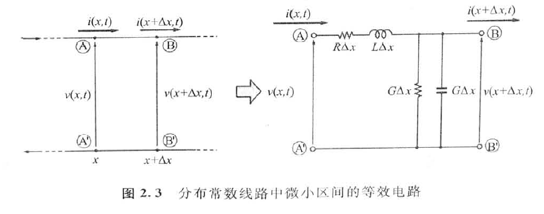

所谓分布常数中的“分布”是指各元件与配线作为具有实际寸元件，以及将一个元件与配线作为集成为微小元件进行处理的意思。也就是说，在一个元件与配线中，具有某值（常数）的微小元件即为“分布”元件。

3.集中常数电路的特殊性
集中常数与分布常数之间的判定并不仅仅取决于频率。还有元件的位置及配线的长度和宽度，如果它们的改变也引起电路的性能发生较大变化，则该i电路必须作为分布常数电路进行处理。如长度为1500km的输电线，输送50Hz的电信号，假设以光速传输电力，波长约为6000km，则在送电端和受电端其相位差90°。在送电端电压振幅最大时，则在受电端电压振幅变为零。信号的振幅和相位因位置不同而有很大差异，因此该输电线对50Hz信号而言也是分布常数电路。

集中常数电路是分布常数电路的特殊电路，用于在传输线中偏号的振幅和相位近似不变的场合。集中常数电路的特殊场合绝不是分布常数电路的场合。
图2.5示出集中常数和分布常数之间的关系。现将以上内容归纳整理如下：

①集中常数电路。
电路的尺寸相对信号的波长可以忽略的电路为集中常数电路。

②分布常数电路。
电路的尺寸相对信号的波长不能忽略的电路为分布常数电路。

##### 2.3高频中最重要的工作是传输线的设计

2.3.1表示传输线电气特性的“特性阻抗”
求解图2.3所示等效电路得到的方程式，从而得到线路上电压和电流的表达式，由此求出称为该线路的特性阻抗（character-
istic impedance）。
特性阻抗Z。可用下式表示：
$$
Z_{0}=\sqrt{\frac{R+j \omega L}{G+j \omega C}}
$$
由式（2.2）可知，Z。由每单位线路长度的R、L、G、C决定。由于R、L、G、C由传输线的构造与尺寸决定，因此，考虑传输线时，特性阻抗乙。是非常有用的参数。
线路损耗即R和G较小时，式（2.2）可近似由式（2.3）来所示。

$$
Z_{0} \approx \sqrt{\frac{L}{C}}
$$
在高频电路中，有“特性阻抗50Ω传输线“的现法。然，行细考察一下式（2.3）。可见在该式中，完全不含电阻成分R。Z。由传输线每单位长度的L和C之比来定义，因此，使用Z。=50Ω
传输线，这与低频电路相同，即使用万用表测量传输线与地间的电阻值也不能显示出50Ω。
在式（2.3）中，没有与传输线长度相关的项。因此，若传输线的构造（除长度以外的实际尺寸与材顾）相同，则传输线长度为1cm和1m时，Z。完全相同。若要更详细了解传输线方程式等的推导过程，请参照本书末的参考文献[1]、[2]。

2.3.2高频使用的传输线
构成分布常数电路的传输线特性阻抗由以下要素所决定：
①构造；
②实际尺寸；
③基板材质。
为此，制造出适合不同用途的各种构造传输线。现将其中经常使用的传输线加以介绍。
1.微带线（microstrip line）
微带线的截面构造如图2.6（a）所示。上面的导体为传输线，下面的导体为地线。这是将传输高频的同轴电缆切开，压破中心导体而构成的图像。

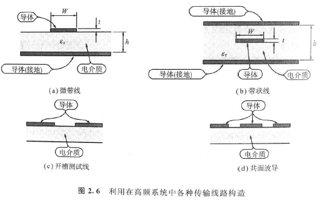

微带线适合表面贴装元件（SMD）的组装，由于容易制造，因此在基板上制作分布常数电路时最常使用。
Z。由所使用基板的相对介电常数和厚度以及导体厚度和宽度等决定，若使用较高相对介电常数材质的基板，则可使电路小型化。
除了注意以下两点外，由于是与通常印制图案处理相同，因此也适合于低频电路和数字电路的混合场合。
①必须将传输线内侧设在接地面。
②传输线宽度由所期望的特性阻抗决定。
2.带状线（strip line）
为了使各种电子机器小型化，必须缩小印制基板。此时，可使用多层基板。在这些基板内层构成分布常数电路时，最常使用的是带状线，图2.6（b）示出其截面构造。这是将同轴电缆压破而形成的板状图像。
带状线能在基板内封闭电磁场，因此，有传输损耗比微带线小的优点。但缺点是，由于传输线深入内层，因此不容易调整。它与微带线相同，传输线的特性阻抗由印制基板的相对介电常数与厚度、导体的厚度与宽度等决定。
除此之外，还有开槽测试线和共面波导等各种构造的传输线。
图2.6（c）和（d）示出这些构造。
由于微带线和带状线特性阻抗的计算式是由10个近似式构成，因此这里没有示出。请参照本书末所列的高频参考书[3]~
[5]等。

从集中常数角度看微带线
仔细观察一下图2.A所示的微带线，则发现上面和下面导体图案为平行配置，形成电介质挟在中间的构造，这种构造有时是看不见的。

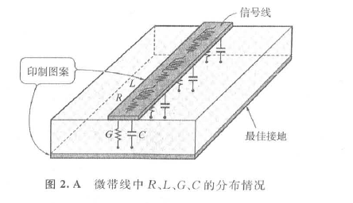

这与平行平板电容器的构造相同。也就是说，微带线认为是每单位长度具有一定容量进行并联的电容器。
导体间的电介质不是完全的绝缘体，它具有一定的电阻率。单位长度的激带线具有一定电阻值。这与上述电容器一样，对于传输线为并联分布。训北r旧让管上较容易处理的电导表示其阻抗成分。

##### 2.4用分布常数与集中常数制作的高频电路

用集中常数和分布常数构成的电路有何不同呢？试将特性进行比较。图2.7（a）示出用集中常数构成的带阻滤波器（BEF:Band Elimination Filter），图2.7（b）示出用分布常数构成的BEF。

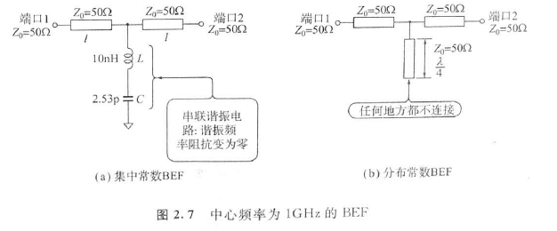

1.电路的差异
（1）集中常数BEF在传输线和地之间接入L和C构成的串联谐振电路，谐振频率时阻抗为零。但由于作为集中常数进行处理，因此L和C不具有一定的数值。
（2）分布常数BEF在图2.7（b）中不了解其示意图，试考虑为图2.8所示那样，它为基板上微带线的印制图案。但是，对于所有线路按Z，=50Ω
进行设计。由该图可知，顶端为开路的线路只是从传输线途中分支的电路。

从主传输线分支的该部分称为截线（stub）。因截线顶端不同任何处连接，因此称为开路截线。

2.分布常数BEF的工作原理
用图2.9对此加以说明。由于无严格意义上的说明，因此.可作为工作示意图进行理解。在BEF中心频率处，截线长度设定为λ/4，

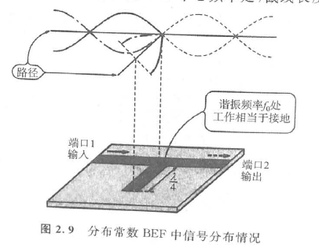

开路截线的顶端为开路状况，其顶端电压振幅变成最大。而且，由于截线的长度设定在中心频率f。相应波长的1/4（=1/4）处，因此截线的顶端和其根部的相位相差90°。顶端的振幅最大，而根部的振幅变为零。
也就是说，对频率为f。的信号而言，截线的根部犹如接地（基准点）一样。

3.传输特性
这里，考察一下各种电路的传输特性。
图2.10示出集中常数电路和分布常数电路的特性。中心频率设定为1GHz。

分布常数是对于1GHz频率，用A/4的理想开路截线进行仿真。由图2.10可见，集中常数电路（图2.10（a））仅是示出1GHz处的BET特性，而分布常数电路（图2.10（b）不hx定lohz处重复相同的特性。其原因何在？
图2.11是对各频率示出开路截线上电压振幅的示意图。信号频率为1GHz时，图中开路截线相当于x/4，3GHz时相当于3A/4。也就是说，即使为3GHz，截线的根部电压振幅也变为零。
5GHz和7GHz时也都是一样的。
考虑分布常数电路时，不仅只是看到计算与仿真的结果，在印制图案上传播“波”的图像也非常重要。
如图2.12所示，若截线的顶端接地的话，该电路就表示带通滤波器（BPF:Band Pass Filter）特性。

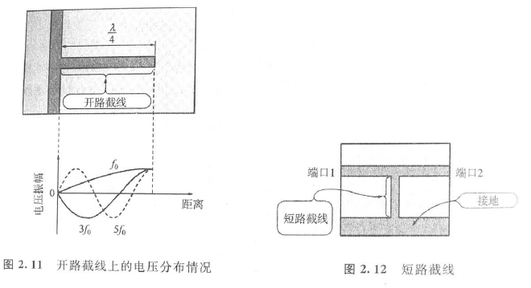

##### 2.5 高频中功率比电压与电流更容易处理

2.5.1S参数的概要
1.用S参数表示元件和电路的输入输出特性在一般电气电路和电子电路中，为了表示电路特性，使用了参数、Y参数、A参数（图2.13）等，但前提是这些参数要用电压和电流来测定并评价电路特性。
对于高频，几乎不能像低频那样测量电压与电流。例如，为了测量电压，若将探头等接触到印制图案上，该探头就具有了如上述的截线（stub）功能，使电路构成发生改变。即使不接，若只是近印制图案，也会影响其周围的电磁场，于是电路本来的特性也随之改变。
因此，必须用取代电压或电流的其他量进行测量与评价。在高频领域也能稳定而正确测量的量是功率。若只是研究电路输入功率和输出功率之间的关系，则可将电路网路作为黑匣子进行处理。在高频电路中，用电压或电流时不考虑电路特性。用电流或电压也几乎不能表示电路特性。若在高频电路中处理电压或电流，则只是直流偏置而已。

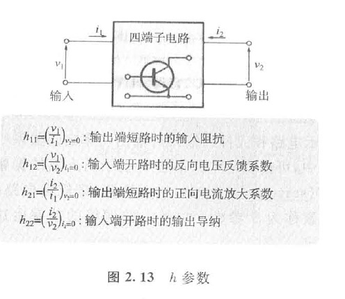

（1）表示电路和元件的输入与输出功率之间关系S参数

在高频中，可由表示电路的各对端子出入波的振幅和相位关系的S矩阵（scattering matrix，散射矩阵）来规定电路的特性。
矩阵的各要素称为S参数。出入电路网络的功率由这些波的振幅和相位决定。
图2.14示出双端口电路（四端子电路），用于说明该波与S加阵。各端口的电压2。和电流i。

如下式所示，它分别用行波（进入电路的波）、回波（电路出来的波）之和表示。
$$
\begin{array}{l}{v_{n}=\vec{v}_{n}+\vec{v}_{n}} \\ {i_{n}=\vec{i}_{n}+\vec{i}_{n}}\end{array}
$$

$$
\begin{array}{l}{a_{n}=\frac{\vec{v}_{n}}{\sqrt{Z_{0}}}=\vec{i}_{n} \sqrt{Z_{0}}} \\ {b_{n}=\frac{\vec{v}_{n}}{\sqrt{Z_{0}}}=i_{n} \sqrt{Z_{0}}}\end{array}
$$

Z0为电路网络中连接的传输线的特性阻抗。
若将该式的两边平方，则得到如下关系式：

$$
\begin{aligned}\left|a_{n}\right|^{2} &=\frac{\left|\vec{v}_{n}\right|^{2}}{Z_{0}}=\left|\vec{i}_{n}\right|^{2} Z_{0} \\\left|b_{n}\right|^{2} &=\frac{\left|\vec{v}_{n}\right|^{2}}{Z_{0}}=\left|\vec{i}_{n}\right|^{2} Z_{0} \end{aligned}
$$

各端口的输入功率Pn表示如下：
$$
P_{n}=\left|a_{n}\right|^{2}-\left|b_{n}\right|^{2}
$$

式中，a_n和b_n为复变量，它是具有大小和相位的信息。而绝对值的平方可分别表示输入和输出方向的功率。
所谓S矩阵是定义a_n和b_n之间的关系，可用下式表示：

$$
\left[\begin{array}{l}{b_{1}} \\ {b_{2}}\end{array}\right]=\left[\begin{array}{ll}{S_{11}} & {S_{12}} \\ {S_{21}} & {S_{22}}\end{array}\right]\left[\begin{array}{l}{a_{1}} \\ {a_{2}}\end{array}\right]
$$

由式（2.6）、（2.7）、（2.11）可知，S矩阵各要素随各端口所连接传输线的特性阻抗Z0而变化。

例如，对于输出输入为同轴连接器的电路，这意味着具有输入输出连接器的特性阻抗。

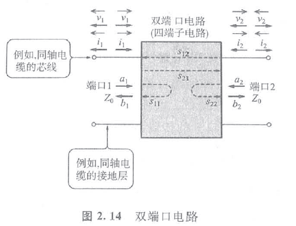

（2）若无特别说明，则特性阻抗仍为50Ω
由式（2.11）可知，S参数值虽随Z。而变化，但尤其在高频领域，或许可仍考虑Z。为50Ω。其原因是，若使用S矩阵的厂商或个人能随意决定Z。，则会发生混乱。
对于高频使用的频谱分析仪、网路分析仪等测量仪器，除了特殊场合之外，其输入输出端子的特性阻抗都为50Ω。

2.S11、S22、S21、S12的意义再一次考察一下，式（2.11）中S矩阵各参数的意义。
S11~S22各参数可用下式表示：
S11 = b1 / a1，但a2=0（2.12）
S21 = b2 / a1，但a2=0（2.13）
S12 = b1 / a2，但a1=0（2.14）
S22 = b2 / a2，但a1=0（2.15）
S11是端口2作为终端，其阻抗为Z0，这是端口1输入波时，表示与反射回来波的比率，即为反射系数。
S22是表示端口2的反射系数。
S21是Z0端口2作为终端，其阻抗为Z0，这是端口1输入波时，表示传输给端口2波的比率，即正向传输系数。
S12与Sa相反，表示反向传输系数。

3.多个端口电路中S参数的意义
对于多个端口电路，其S参数的意义表示如下：
$$
\begin{array}{l}{S_{i j}=\frac{b_{i}}{a_{i}}} \\ {S_{j i}=\frac{b_{j}}{a_{i}}}\end{array}
$$

Sij是除端口i以外的端口作为终端，其阻抗都为Z。时，端口的反射系数。Sji是除端口i以外的端口作为终端时，其阻抗都为Z0时，从端口i到端口j的传输系数。

2.5.2实际高频元件数据表中记载的S参数

1. 高频晶体管2SC5509的S参数
    在高频微波晶体管数据手册或数据表中记载了S参数。
例如，表2.1是表示在日本电气2SC5509数据表中记载的s参数数据的一种。

在S参数数据的前面，示出了偏置等测试条件。一般来说，在数据表中，记载了多种条件下所测试的S参数数据。进行仿真时，选择最接近设计条件下所测试的S参数数据。
表2.1示出0.1~18.0GHz频率点的S参数。
由MAG（magnitude：振幅）和ANG（angle：相位）的组合方式表示S11~S22的各种参数。

2. 1GHz时2SC5509的工作情况试根据1GHz时S1~S22的数据，考察一下该晶体管的特性。
    （1）由S1来理解
S1（反射系数）为0.671。
若将匹配电路接入输入侧，则由下式可知，这意味着约输入功率的45%会反射回来。
b1"=a1*S1=（0.671）*212*~0.45a1（2.18）由此可知，若原封不动，则效率很差，因此，需要接入匹配电路。
（2）由S21来理解
S2：（传输系数）为5.409，因此，输入信号被放大了。具体来说，若将输入输出接在Z。=50Ω的传输线上，并施加偏置，则可以得到约14.7dB（29.3倍）的功率增益。

6a2=（5.409）2a12~29.3a12（2.19）
（3）由S12来理解
Sie（传输系数）为0.101，因此从输出侧出来的输入信号被衰减。在输出侧出来的信号约衰减19.9dB（0.01倍）。
b12=（0.101）2a22~1.02×102a22（2.20）
（4）由S28来理解
S2a（反射系数）为0.434，若在输出侧接入匹配电路，从输出侧输入信号，则约有19%的功率被反射回来。
b22=（0.434）2a22~0.188a22（2.21）若从晶体管来看输出侧，输入功率被放大了，而从晶体管输出的功率中约有19%功率不向外输出，即在出口端被反射回来。

##### 2.6用史密斯图求阻抗

2.6.1史密斯图
1.高频中不方便使用正交坐标
在图2.15所示正交坐标中，试考察一下描绘某电路输入阻Z。=R+jX的频率特性。
Zn=o
/X
？1Zn=R+）
50+50R
|由于④点阻抗匹配于@点502阻抗，因此从曲线上不能获取这种电路或常数的设定方法图2.15正交坐标系中表示的高频电路阻抗z。
在坐标中，也描绘了Z。=50Ω的③点。此处，某频率阻抗（点）必须匹配50Q（@点）的情形如何呢？在该坐标系中，只能了解50Ω的偏差，不知道如何取得匹配。
设定匹配电路的形式（元件数、申联接入的元件、并联接入的元件等），建立方程式，并进行计算，可求出匹配电路的元件值。另外，也不能表现谐振电路等常见的无限大阻抗。
匹配的详细情况以后叙述。
2.能用眼观察匹配程度
（1）反射与匹配之间关系密切
匹配的电路或元件处于输入的功率不被反射回来的状态。相反，失配的电路或元件处于输入的功率的一部分或全部被反射回来的状态。
这样，功率反射的比率（反射系数）与阻抗匹配之间有密切的关系。
（2）用史密斯图确认其匹配状态这里，试表示输入功率侧与被输入侧的两个阻抗间的反射系数。
假设某电路的输入阻抗为Za，其输入的反射系数可用下式表示：
n一1
r一个杂=和Ir10（2.2）
2云+2
。Zn尝+1式中的Z。是接在该电路中电路或传输线的特性阻抗。
若用反射系数口取代阻抗的表示形式（Z。=R十jX），则可用0~1的大小（magnitude）和一180°~+180°的相位（angle）组合表示对应阻抗量。
由式（2.22）可知，由于||≤1，若用0~o阻抗成分和一0~
+oo电抗成分之和表示阻抗，则在半径为1的圆中（图2.16）都能表示出来。
Z。换算为反射系数表示时，如图2.17所示，可简单地用离中心的距离（厂的大小）与角度（T的相位），描绘出这种情形。
3.匹配电路的设计
这样，若使用史密斯图，则以距中心点的距离形式，从视觉上理解电路匹配和反射的程度。那么，实际设计时如何使用呢？若某电路的输入阻抗Z。与特性阻抗Z。相同，即取得阻抗匹配，则Z。绘制在史密斯图的中心。
这是根据某种规则，在史密斯图上，移动其图上绘制的任意阻抗点，使其位于中心位置那样设定电路或常数，这意味着与匹配电路设计时相同。

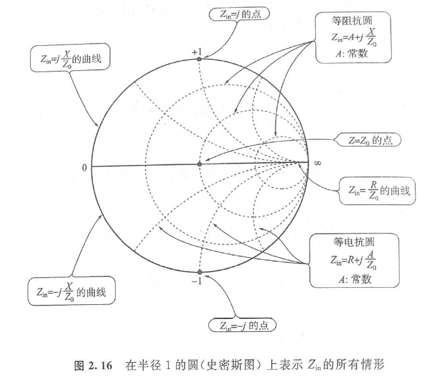

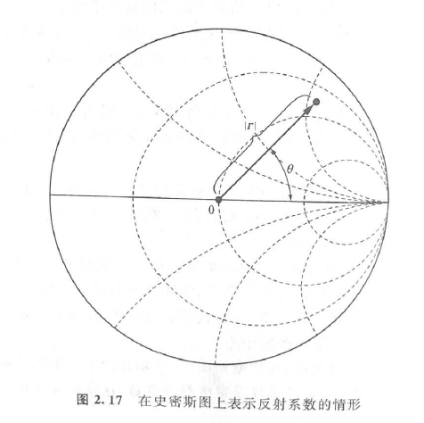

2.6.2在史密斯图上描绘阻抗
1.用50Ω进行规格化
那么，如何在史密斯图上描绘用Zm=R+jX表示的阻抗呢？请实际描绘看看。
由式（2.22）可知，为了在史密斯图上描绘Za，要用Z。进行规格化，即用Z。将其分为电阻成分R与电抗成分X，从而求出规格化阻抗z（z=Zm/Z。）。
2.描绘规格化阻抗规格化的阻抗之为：
x=r+jx（2.23）针对几种情况，试考察一下在史密斯图上如何描绘这种规格化阻抗。
（1）在史密斯图上描绘Z=50Ω的情形若用50Ω将Z=50Ω规格化，则求出z为：
50+i0=1+j0（2.24）x=50因此，可在位于横轴上史密斯图的中心，即在图2.18中的④
点描绘出Z=50Ω的情形。（2）在史密斯图上描绘Z=0Q的情形求出的z如下：
9+i0=0+j0（2.25）z=50因此可在横轴上的左端，即在图2.18中的⑧点描绘出Z=
0Q的情形。
（3）在史密斯图上描绘Z=oo0的情形求出的z如下：
=90+i0=00+j0（2.26）
50因此，可在横轴上的右端，即在图2.18中的◎点描绘出Z=
oQ的情形。
（4）在史密斯图上描绘Z=j50Ω的情形求出的z如下：
=9+j500+；（2.27）
50因此，可在x=j1的等电抗圆与外周圆的交点，即在图2.18

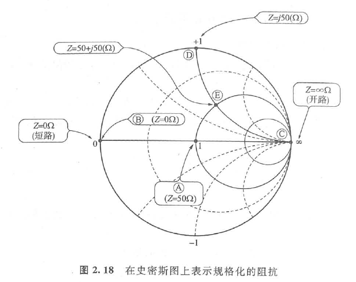

中的①点描绘出Z=j50Ω的情形。
（5）在史密斯图上描绘Z=50+j50Ω的情形求出的z如下式，
2=50+i5点50=1+i1（2.28）
50因此，可在r=1等阻抗圆与x=+j1等电抗圆的交点，即在图2.18中的⑥点描绘出Z=50+j50Ω的情形。
2.6.3元件与传输线路的增加以及史密斯图上的阻抗轨迹
在输入阻抗为Zm=Rn+jX。电路的输入端，并联或串联电阻、电容、电感等元件时，试考察一下史密斯图上的点是如何移动
1.增加与Zm串联元件时
①电阻R。如图2.19（a）所示，在等电抗圆上移动到Zak。②电感L。如图2.19（b）所示，在等阻抗圆上以电抗增加的方向（顺时针方向）移动到Zl.。
③电容C。如图2.19（b）所示，在等阻抗圆上以电抗减少的方向（逆时针方向）移动到Zc。

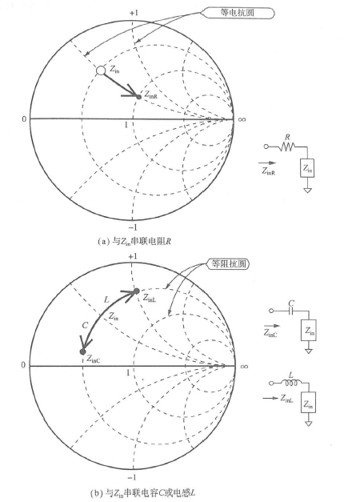

2.增加与Zm并联元件时
并联时，可利用工作容易理解的导抗图（后面介绍）。
①电阻R。如图2.20（a）所示，在等电纳圆上移动。
②电感L。如图2.20（b）所示，在等导圆上以电纳减少的方向（逆时针方向）移动。

③电容C。如图2.20（b）所示，在等电导圆上以电纳增加的方向（顺时针方向）移动。

3.在Z。中增加Z。的传输线时在电路的输入端接入特性阻抗为Z。的传输线时，试考察一下，Zm在史密斯图上如何移动。

假设接入电气长度0（长度+波长×360°）的传输线。如图
2.21所示那样，将距中心的距离仍保持一定，以顺时针方向旋转20.由于用史密斯图能观察反射特性，因此，信号在入射与反射时，都2次通过传输线。这样以所接入的传输线的电气长度2倍角度，即20进行旋转。由于传输线无反射，因此反射系数y不变，只是相位发生变化。
（中）图2.21在Z。中串联传输线时的轨迹这样，若使用史密斯图，由于能增加元件和传输线并获得反射量，因此，可以设计用适当元件和传输线构成的匹配电路。某阻抗与特性阻抗进行匹配时，在史密斯图上其移动路径为无限多，但用惯了史密斯图，就能逐渐理解哪种匹配电路较适应。只要观察一下，史密斯图上描绘的阻抗轨迹，其移动路径与匹配电路的构成就会浮现在脑海中。

导纳图和导抗图的灵活运用
史密斯图是将阻抗和反射系数的关系以图表形式化的图，因此，适用于串联电路（元件）的处理。另外，处理并联电路（元件）时，采用导纳的方式比较简单。
图2.B是将导纳和反射系数的关系以图表形式化的图，称为导纳图。这是将用Y。=G+jB表示的电导G与电纳B进行规格化而加以描绘的。史密斯图是用2。进行规格化，但导纳图是用Y。=1/Z。进行规格化，因此，上下左右颠倒了。导纳图（图2.C）是将史密斯图和导纳图重合画在一起的图。进行同时处理串联电路（元件）和并联电路（元件）时也非常方便。

##### 2.7高效率地传输高频信号的技术——匹配

在高频电路中，几乎不能像低频电路那样测量电压与电流。
其原因是为了测量电压，要将探头等接触到印制图案上，这时探头就具有如截线那样的功能，使电路构成发生变化。另外，即使不接触，只要靠近印制图案，其周围电磁场发生变化，从而使电路的本来特性改变。因此，需要采用取代电压或电流的量测量，并评价高频电路中的量。
在高频领域中也能稳定且正确测量的量是功率。电路的输入功率与输出功率密切相关，可将电路网络作为黑匣子进行处理。

由于高频电路中考虑的是功率的传输，因此，重要的是无损耗且能有效地传输功率。为此，在高频电路中，电路间的阻抗匹配也非常重要。毫不夸张地说它是高频电路设计的基本技术。在高频电路中，若无特别说明，特性阻抗Z。是以50Ω作为基准。对于具有输出输入端子的电路，若说是“输出输入取得匹配”，这意味着输出输入阻抗设定为50Ω。
2.7.1禁止使用电阻取得匹配
1.“50Ω匹配”的含义
假定有某频率时输入阻抗Zm为20Ω的电路A。“将电路A与50Ω匹配”的含义是什么呢？
所谓“与50Ω匹配”，是指“从外部看电路A的输人时，为了使阻抗变为50Ω，增加某些电路并进行调整，使其取得匹配”的意思。
若是熟悉高频电路的人，如图2.22所示，马上想到的是“串联接入电感L，然后，并联接入电容C，使其具有史密斯图上50Ω的点”的情形。然而，“只理解低频电路，而对高频电路稍难对付……”的人对此经常看错。
2.尽量减小匹配时的损耗
有位客户提出了所设计的接收装置样品的如下条件。
*
作者：由于接收装置的天线输入特性阻抗设计为50Ω，因此天线输入端连接的天线也应与50Ω进行匹配。
过了几天以后……
客户：接收单个模块特性的评价，得到与检查表中值大致相同的结果，但连接上天线进行通讯实验时，则完全不能确保通讯距离。
作者：天线与50Ω取得了匹配吗？
客户：由于天线的输入阻抗为20Ω，因此，天线与接收模块之间要接30Ω的电阻。作者：原来如此？
*
从接收模块看天线侧的输入阻抗或许为50Ω。然而，这里却出现了很大的错误。
在高频电路中，为了高效率传输功率，阻抗匹配也非常重要。
然而，匹配电阻要消耗功率，因此降低了效率。
在高频电路中，为了抑制放大器的异常振荡使其稳定工作，使用了电阻，但取得电路间的匹配时不使用电阻。2.7.2阻抗匹配实例1以下，说明不使用电阻进行阻抗匹配的方法。
1.例题
试求出图2.23所示的电阻（10Ω）和电感（10nH）的串联电路与匹配电路，频率为1GHz。
该电路中，1GHz时输入阻抗Z。为Z。=10+j62.8（Ω）.设50Ω规格化的阻抗为ZA，则有ZA=0.2+j1.26。
假设50Ω规格化导纳为yA，则有yA=0.12-j0.78.
2.使用导抗图
在匹配电路中，使用串联元件和并联元件。因此，使用史密斯图和导纳图重合画在一起的导抗图非常方便

3.④点向国点移动
在图2.24所示图中，把规格化阻抗xA作为图中一点（④点）。
若将该点沿着等电导圆移动，就会遇到通过图中心的等电阻圆。。

若从图中读取接触点（③点）的阻抗Zs和导纳Ya，则得到的结果如下：
Z：=1+j2.66，Ya=0.12-j0.33
（1）并联电容
从③点移向⑧点时，若注意z和y值的变化，则x为实部和虚部两者的变化，但y只是虚部变化。
可以根据y的虚部变化决定匹配电路的形式。

仅根据y的虚部变化可知，不是串联元件而是并联元件。另外，根据电纳（虚部）变化为正可知，该元件为电容。沿着等电导圆移动可知这一切。
（2）计算电容量
试求出④点向⑧点移动时需要的电容量C1。规格化的虚部变化量为0.45，因此，下式可求出C1～1.43pF。
0.45
C1=50×2元~1.43（pF）（2.29）
4.④点向⑥点移动
其次，该点沿着通过中心的等电阻圆移动到图的中心点（C点）。由于图的中心点为Zc=1.0+j0，yc=1.0+j0，因此，移动到中心点时，Zc只是虚部变化，而yc是实部和虚部两者都变化。
（1）串联电容
由只是虚部变化可知，需要串联元件。
由电抗成分负向变化可知，其元件仍是电容，沿着等电阻圆移动就可知晓。
（2）计算电容量
试求出国点向◎点移动时需要的电容量C2。虚部（规格化电抗成分）的变化量为2.66。因此，根据下式可求出Ca~1.20pF。

2=2.66×50×2-F~1.20（pF）（2.30）最后，得到图2.25所示的匹配电路。
zm—o C21.20p| |$1001.43p÷CG号10nH图2.25得到的匹配电路2.7.3阻抗匹配实例21.“串联电容十并联电感”进行的阻抗匹配使用图2.26进行说明。
在图的上方，所描绘的③点沿着等电阻圆移动，移动到与通过中心的等电导圆的交点⑤而保持下去。再沿着等电导圆移动至中心而保持下去。
元件值的求法与上述一样。移动所需要的各元件值如下。\

（1）串联电容
C=50×2元0×1.66~1.92（pF）（2.31）
（2）并联电感
L=1~3.98（nH）（2.32）
2xf×（竞）
2.“并联电容十串联电感”进行的阻抗匹配请参看图2.27。
在图的上方，所描绘的④点沿着等电导圆移动，移动到与通过中心等电阻圆的交点国而保持下去。
再沿着等电阻圆移动至中心而保持下去。
各元件值如下。
（1）并联电容
1.11
C=50×2元~3.53（pF）（2.33）
（2）串联电感
L=2.66×50～21.2（nH）（2.34）
2x/

3.“串联50Ω传输线十串联电容”进行的阻抗匹配请参看图2.28。

求出连接图中心与所描绘的④点的直线延长线跟图外圆周的交点，读取此处所表示的角度约为76°。
其次，求出通过④点以图中心O点为中心的圆跟通过O点的等电阻圆的交点④。然后，读取连结O点和⑧点直线的延长线跟图外圆周交点的角度，该角度约为31°。因此，角度变化约为45°。
由于有反射，因此，往返加在一起通过两次，该旋转所需要传输线的电气角度为其一半，即22.5°。然后沿着等电阻圆移动到中心而保持下去。电气角度为移动所需要的各元件值如下：
（1）串联50Ω传输线
电气角度22.5°。
（2）串联电容
C=50×2元/×3.35~0.96（pF）（2.35）
4.“串联50Ω传输线十串联电感”进行的阻抗匹配请参看图2.29。

这是上述的“并联电容+串联电感”进行的阻抗匹配，跟“串联50Ω传输线+串联电感”进行的阻抗匹配的组合形式图。

2.7.4匹配电路构成的不同造成输入阻抗特性的差异试通过仿真比较一下图2.30所示的各匹配电路的特性。图
2.31~图2.34示出输入阻抗特性的仿真分析结果。

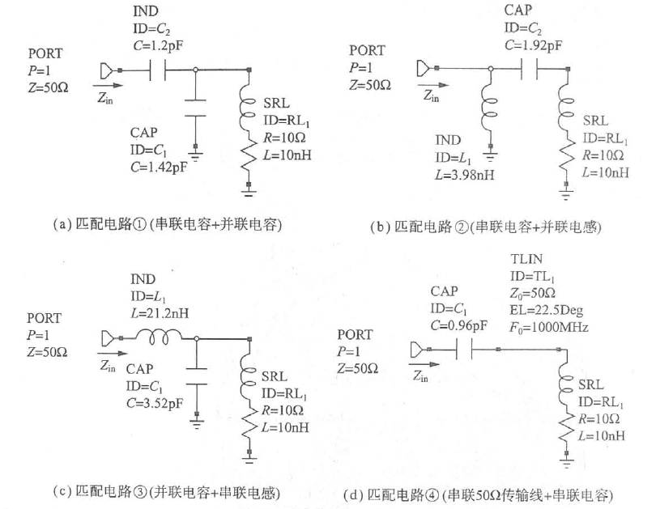

从比较各匹配电路的频率特性看，输入阻抗特性完全不同，反射损耗特性的差异不大。
在阻抗特性图中，示出了④点（0.95GHz）、③点（1GHz）、O点（1.05GHz）的三种频率输入阻抗。
1.匹配电路①
④点位于史密斯图的下半部分，电抗成分为负，即位于电容性领域。◎点位于史密斯图的上半部分，电抗成分为正，即位于电感性领域。
以⑧点为界，电抗成分的极性改变，频率越高其电阻成分越大。

2.7.5使用实际元件的匹配电路
1.几乎无法计算出来常数的元件在目前通过仿真设计的匹配电路中，可忽视之处是构成匹配

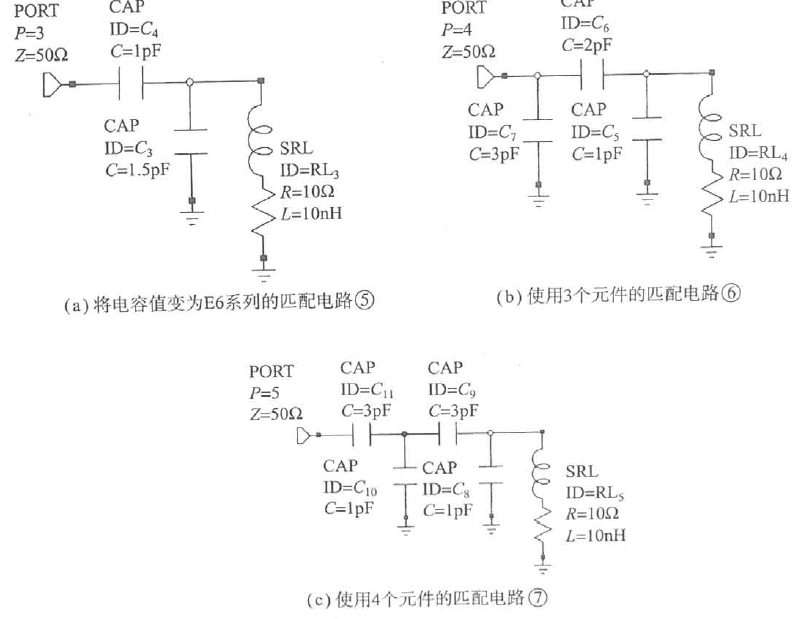

1.8、2.0、2.2，一般是不连续。认为最好使用像微调电容那样其值可调的元件，但必须尽量减少工时多的调整作业。
实际上，只用这些不连续值的两个元件（标准品）进行组合是无法构成完整的匹配电路的。为了得到所需必要的常数元件，要将多个元件组合并进行调整。
2.实际的匹配电路
图2.35示出几个“串联C+并联C”的匹配电路（1）电路⑤（图2.35（a））将元件值变为E6系列常数的电路。
（2）电路⑥（图2.35（b））
用容易取得的元件常数所设计的3个元件的匹配电路。
（3）电路②（图2.35（c））
4个元件的匹配电路。
图2.36（a）示出输入阻抗特性，图2.36（b）示出输入电压驻波比，图2.36（c）示出输入的反射损耗特性。

3.阻抗匹配特性
由图2.36（a）可知，电路⑤是不完善的阻抗匹配。增加1个元件的电路⑥也稍有失配，但比电路⑤有较大改善。
进一步增加元件数目，即用4个元件的电路⑦方案，可得到接近理想电路①的特性。
这样，只要将史密斯图上的移动情况记住，也就不用担心元件数目的增加。

##### 2.8实际无源元件的高频阻抗
1.理想特性与实际的差异
到目前为止的说明中，无源元件是作为具有理想阻抗特性的元件使用的。然而，实际匹配电路的设计与调整时，必须考虑匹配电路中使用的无源元件的频率特性。
例如，容量C（F）的电容，假定在全频率范围内，阻抗特性以一定斜率（1/C）单调减小，如下式所示：
z=dc

另外，对于电感L，假定
然而，实际元件的阻抗频率特性不是单调增减的。
（1）电容变为电感，电感变为电容在单片电感与电容的电气特性一栏中，记载了“自谐振频率（self-resonant frequency）”一项。
对于实际的元件，一定具有因寄生电容、导线及电极等构造引起的电抗成分，必定在某频率处产生谐振。说到元件产生谐振，这意味着元件为电容的话，则具有感抗成分，若元件为电感的话，则具有容抗成分。
对于电容，在自谐振频率以下其阻抗的电抗成分变负，具有电容的功能。而对于电感，在自谐振频率以下其阻抗的电抗成分变正，具有电感的功能。
但是，在自谐振频率以上，电容的电抗成分变正，电感的电抗成分变负。
另外，越趋近自谐振频率，元件的阻抗值越偏离标称值。
（2）实际电容与电感的高频等效电路根据以上叙述，实际电容与电感的高频等效电路参见图
2.37。图中Ls和CG可根据元件目录中从谐振频率中求出。
2.实际电感的阻抗频率特性
试求出单片电感的阻抗频率特性。
电感是太阳诱电制的高频叠层单片电感HK1608 27N（27nH）。
自谐振频率fsur为2200MHz.m。
（1）寄生电容Cp的求法
求出图2.37（b）的等效电路中并联电容C，试通过仿真分析一下频率特性。由下式求出CG。

（2）阻抗频率特性的仿真分析图2.38是仿真电路，图2.39是频率特性的分析结果。自谐振频率外阻抗为无限大，谐振频率的前后，电抗成分的极性反转。由此可知，在自谐振频率以下，电抗成分为正，元件具有电感功能，在自谐振频率以上，电抗成分为负，元件具有电容功能。
（3）用史密斯图确认电抗的极性
试用史密斯图观察图2.39所确认的电抗极性反转的情况。图2.40示出元件有寄生电容时其输入阻抗特性。若元件的阻抗为电感性，则描绘在史密斯图的上半部分；若是电容性，则描绘在史密斯图的下半部分。由该图可知，在自谐振频率（2.2GHz）处，示出特大阻抗。以此点为界，电抗成分的极性发生改变。

##### 2.9.能发挥高频电路性能的印制基板的设计

2.9.1高频电路用印制基板的基础知识试作使用微带线那样平面电路的高频电路时，当然要用基板。
那么，以什么基准去选择呢？
1.介电常数或介质损耗角正切小的基板高频损耗少在基板的目录中，记载有各种特性。表2.2示出高频用基板25N（Arlon公司）的特性。为了进行比较，表中也示出了玻璃环氧基板FR-4的特性。
在表2.2所示的各种特性中，特别重要的是最初部分所记载的介电常数与介质损耗角正切。介电常数决定分布常数线路的尺寸，介电常数主要是微带线，包括计算各种传输线所必要的参数。表2.2中虽无记载，但一般的陶瓷基板的介电常数为10左右。
介质损耗角正切的值越小，传输线的损耗越小。传金线的损龙可分为导体部分的损耗与介质部分的损失，与介质损耗角正切有关的是介质部分的损耗。

2.高频波专用的基板是低损失、特性偏差小若用厚度1mm的基板25N制作长度1cm的50Q线路，可以得到图2.41（a）所示的损耗频带特性。若用导体为铜而厚度为18um的基板，同样可以得到图2.41（b）所示FR-4损耗的频率特性。即便为0.025dB/cm@5GHz时，25N也示出了非常低的总损耗特性，但对于FR-40.237dB/cm@5GHz时也示出非常大的值。
对于GHz频带的高频电路，由此可知使用高频专用基板的理由。
高频电路专用基板是使介电常数等各种特性偏差小那样制造的，因此，可放心使用。2.9.2印制图案的精度与特性阻抗的偏差
1.用电路仿真器进行检验
在图2.42中，使用微波电路仿真器附件的传输线计算工具，根据印制图案宽度的偏差研究特性阻抗的变化程度。基板的参数如下：
·介电常数：3.25。tan：0.001
·基板厚度：0.8mm
·导体厚度：18um
·导体材料：铜
首先，在这种基板上，若求出2.4GHz时特性阻抗为50Ωm印制图案宽度W，则得到W如图2.42所示，即W=1.9028mm
·蚀刻得到的印制图案宽度的偏差为士8um实际制作基板时，对图案精度影响最大的是刻蚀精度。由刻蚀偏差由所使用基板导体的厚度所决定，因此，对于上述基可知偏差为士18um左右。

2.对传输线特性阻抗的影响
（1）士18um的偏差
印制图案宽度偏离设计值士18um时，试考察一下特性阻抗的变化程度。
试将1.9208mm（等于1.9028mm+18um）和1.8848mm（等于1.9028mm-18um）代入图2.42线宽的设定栏。这样，印制图案的特性阻抗计算如下：
①W=1.9208mm时，特性阻抗为49.705Ω。②W=1.8848mm时，特性阻抗为50.298Ω。
特性阻抗的变化量约为士0.3Ω，即约为0.6%。大家是否想到特性阻抗的这种偏差？是否认为没问题？是否能容忍？
（2）士100um的偏差
试考察一下士0.1mm的更大偏差时，特性阻抗的变化程度。
①W=2.0028mm时，特性阻抗为48.410Ω。②W=1.8028mm时，特性阻抗为51.705Ω。
特性阻抗约变化3%。这种偏差如何呢？
3.对电压驻波的影响
试考察一下印制图案宽度为①、②、③、④，仅由长度20mm线构成电路的输入VSWR@2.4GHz时，其情况如下：

①为1.0118；②为1.0119；③为1.0665；④为1.0691。
由其结果可知，即使印制图案宽度的偏差为士5%左右，对于特性阻抗与电压驻波比（VSWR）的影响小，若只考虑传输线是没有问题的。
若用小刀手刻制作基板，可以得到一定程度特性其理由在此这些结果毕竟只是传输线的场合，看到的只是特性阻抗的变化情况。在滤波器等场合，有时要求严格的尺寸精度。

##### 2.9.3印制图案“弯曲”对特性阻抗的影响

一般来说，低频电路设计时，只要将元件进行电气连接，很多情况下工作是没有问题的。然而，对于高频电路，印制图案也必须作为一个元件来考虑，稍麻烦些。
1.图案弯曲，特性阻抗就会变化
由于多是决定基板的外形，因此在规定的范围内，要求基板能容纳下元件与印制图案。这样，配置传输线时，有时需要弯曲印制图案。实际上，这种“弯曲”会影响电路的特性，试通过仿真确认一下这种情况。
使用介电常数为3.25、厚度为0.8mm的基板，假设阻抗502
@2.4GHz的印制图案。2.4GHz时阻抗为50Ω，其图案宽度约为
1.9mm。

图2.44（a）示出图2.43所示的3种印制图案输入电压驻波比VSWR。另外，图2.44（b）示出如图2.43所示那样弯曲型①~
③每两个连接时输入VSWR。
5mm.5mm|约1.9mm R
5mm
|5mm R=1.9mm||5mm
（b）弯曲型②（e）弯曲型③
图2.43一个弯曲部分的3种印制图案
2.经常使用的是弯曲型②或⑤
对于弯曲部分为楼角的弯曲型①，频率越高其VSWR越急刚恶化。

弯曲型②只是斜切掉弯曲型①图案角的形式，但VSWR特性得到了改善，简直看不出来其影响。
弯曲型③也是圆滑的连接形式，可以得到良好的特性。
VSWR最佳的印制图案是描绘成大半径圆的弯曲型（③），但空间效率差不实用。一般来说，经常使用弯曲型②或⑤。

##### 2.9.4邻近接地图案对信号图案的影响

1.接地图案中扶有微带线的阻抗
微带线的背面为最佳接地，表面为传输线图案，图2.46所示的构造图刊载在各种图书中。然而，实际上对于大部分高频印制基板，接地图案而不是在传输线的两侧，这些印制图案彼此影响。
导体（传输线）介质
导体（接地）图2.46一般书中常记载的微带线的构造曾有一种说法“若信号图案与两侧接地图案的间隔约为信号图案的宽度，则对传输线的特性无大影响”，这是真的吗？
2.通过仿真进行分析
现在，有称为电磁场仿真器的便利工具。利用这种工具，可根据间隔的大小通过仿真分析微带线输入阻抗Zm的变化。
（1）两侧无接地时
图2.47（a）示出在信号图案的两侧无接地图案时，仿真用的微带线。基板的介电系数设定为3.25，图案宽度设定为2.0mm，基板的厚度设定为0.845mm，并准备好2.4GHz时特性阻抗为50Ω的印制图案。
图2.47（b）示出2.4GHz时输入阻抗的分析结果。可以得到设定那样的r=1，即Zm=50Ω的结果。
（2）两侧有接地时
以此为基准，在信号图案的两侧，配置接地图案，一面对与信号图案的间隔变化为2.0mm、1.0mm、0.5mm，一面进行仿真。在接地图案部分，为了再现接近实际图案的状态，配置0.5mm的方形孔。
图2.48~图2.50示出仿真结果。

3.信号图案与两侧接地的间隔约为信号图案宽度时，可得到通过计算所得出的传输线的特性
由图2.48可知，增加到与信号图案宽度相同的2.0mm间隔时输入阻抗为：
Zm=50r=50×0.992～49.6（Ω）（2.40）稍有变少（约0.8%）。同样，1.0mm间隔时，得到Zm～
47.4Ω、0.5mm间隔时，得到Zm～42.5Ω。由上述可知，在信号图案与邻近接地图案之间，若增加到与信号图案宽度相同的间隔，则对于信号图案阻抗的影响极小。

##### 2.9.5邻近信号图案的耦合会彼此影响

1.模拟电路中，印制图案设计的好坏决定其性能对于数字电路，各信号线上传输信号的电压振幅大致相等，对噪声的裕量也很大，因此不会意识到印制图案的间隔等。实际上，只要观察一下数字电路的印制基板，多条信号线为平行排列。然而，对于处理微弱信号的很多模拟电路，有时电路间的信号电平有较大差异。此时，需要分别描绘出信号电平不同的印制图案，不能像数字电路那样轻易地描绘出印制图案。
2.印制图案的间隔与彼此的耦合度（1）仿真条件
那么，利用微带线的高频电路时情形又如何呢？在彼此邻近的2条微带线间，其耦合程度如何呢？试用电磁场仿真器进行分析。
设基板的介电系数为3.25，图案宽度设定为2.0mm，基板厚度设定为0.845mm，使其2.4GHz时特性阻抗为50Ω。

平行配置2条长度为20mm的微带线，一面改变其间隔，一面分析线间耦合度的变化情况。在分析区域的上部不用导体覆盖，而是收容在无盖的完全导体盒内的状态。线间隔为0.5mm、
1.5mm、2.5mm、3.5mm时，在500MHz~10GHz的频率范围内，步进频率为500MHz时进行仿真分析。
（2）仿真结果
图2.51示出分析用印制图案，图2.52示出分析结果。
S21表示端口1到端口2的传输特性。S31和S1分别表示端口1到端口3，端口1到端口4的传输特性。
其特征是S1为山形频率特性。这是由于长度20mm的微带线在2.3GHz附近时变为1/4波长，在7GHz附近变为3/4波长所产生的现象。有效利用这种耦合的是方向性耦合器（directional coupler）。
由于肉眼看不见空间的耦合情况，因此，需要考虑以下两个方面：
①有电位差的信号线要尽量分开排列。
②在印制图案间要接入接地图案。

# LNA

# Mixer

# 高频开关